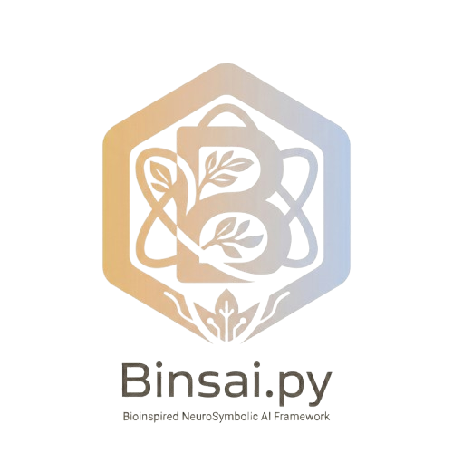

<p align="center">
  
</p>

<h1 align="center">Binsai.PY</h1>

<p align="center">
  <a href="#english">English</a> · <a href="#español">Español</a>
</p>

<p align="center">
  <a href="https://pypi.org/project/binsai/"></a>
  <a href="https://github.com/codewithpatelo/binsai/blob/main/LICENSE"></a>
</p>

---

<a id="english"></a>

## English

**Bio-Inspired Neuro-Symbolic AI — give agents motivations, not just capabilities**

> *Binsai is an interoperable Python substrate for building situated, event-driven and self-regulating AI agents.*

**Binsai** is a regulatory harness for existing agent frameworks (LangGraph, AutoGen, CrewAI, OpenClaw). It adds motivations and internal self-state without forcing you to abandon your current stack.

Instead of only asking what an agent can do, Binsai helps decide **why, when, and whether it should act**.

**Current version**: 0.0.1.dev0 · **Status**: MVP 1 "Hungry Agents" ✅ — [See demo](examples/mvp1_hungry/)

---

## Why Binsai exists

### The problem: motivation is usually external

Modern agent frameworks make LLMs more capable by adding tools, memory, workflows, and communication protocols.

But motivation is usually external: a graph, supervisor, or queue decides when the agent acts.

Binsai adds an internal regulatory layer: drives, needs, set-points, deficits, social/computational budgets, and adaptive intervention policies.

### The proposal: a bio-inspired regulatory substrate

Binsai is a Python library for adding bio-inspired drives and regulatory self-state to LLM agents.

It provides FIPA-inspired communication, async perception, explicit time/space context, regulatory drives, and adaptive intervention policies.

We draw from cognitive neuroscience, cybernetics (Stafford Beer), and systemic materialism (Bunge-Romero) to build agents that:

- Have **stratified needs** (from computational resources to purpose)
- Regulate behavior through **homeostasis and allostasis**
- Decide **when, how, and if** to act (regulated proactivity)
- Are **auditable** (we know why they did what they did)

Binsai does **not** replace frameworks like LangGraph, AutoGen, or OpenClaw. It gives them internal motivational dynamics.

---

## Installation

```bash
pip install binsai
```

Or with Poetry:

```bash
poetry add binsai
```

## Quick Start

```python
from binsai import World, WorldConfig

# Deterministic simulation from seed alone
config = WorldConfig(seed=42, dry_run_llm=True)
world = World(config)

# Run 10 ticks
for _ in range(10):
    frame = world.step()
    for a in frame.agents:
        print(f"tick={frame.tick}  {a.name}: δ={a.delta}, zone={a.zone}, action={a.action}")
```

This creates 3 agents (Alpha, Beta, Gamma) with heterogeneous λ rates. Gamma starts unregulated for ablation comparison. Each tick: demands arrive, agents appraise and act, drives evolve.

Full demo: [`examples/mvp1_hungry/`](examples/mvp1_hungry/)

### MVP1: What works now

This release is **MVP1 — Hungry Agent**. It implements the metabolic drive layer (Bunge S1) with:

- **One active drive**: `metabolic` — regulates when the agent sleeps, acts fast, acts slow, defers, or goes idle.
- **FIPA lifecycle**: `INITIATED → ACTIVE → SUSPENDED → ACTIVE` with causal transitions.
- **Sleep/consolidation**: When metabolic deficit exceeds threshold, agent suspends; wakes when recovered AND queue is empty.
- **State injection**: Regulatory state (δ, zone) is embedded in LLM prompts so the model reads its own "physiology".
- **Symbolic pre-check**: A minimal rule-checker gates proactive actions based on drive zone and queue size.

**What is NOT in MVP1**: The other 9 canonical drives do not yet affect behavior. Memory is native bounded working memory only (no LangGraph/LlamaIndex/Mem0 adapters yet). Neuro-symbolic layer is a rule-checker, not yet DeLP/AHP/TOPSIS.

---

## What makes Binsai different

### Stratified drives

Since 2019, the [AopifyJS roadmap](https://github.com/codewithpatelo/aopifyjs) included:
> "Homeostatic Motives system"

Binsai now implements this with philosophical grounding: **10 canonical drives** across 6 ontological levels (Bunge-Romero):

- **S1 Material**: `δ_metabolic` (tokens, energy, latency) — **MVP 1**
- **S3 Biological**: `δ_safety`, `δ_epistemic`, `δ_coherence`, `δ_competence` — **MVP 2**
- **S4 Technical**: `δ_artifact_integrity` (Safe AI), `δ_niche_construction` (Engels/Lewontin)
- **S5 Social**: `δ_relatedness`, `δ_autonomy`
- **S6 Technological**: `δ_meaning` (purpose)

Each drive has set-points, decay rates, and **fuzzy sigmoid activation** (no hard thresholds). Per Driveplexity A2: `D(δ) = (δ · σ(k·δ))²`.

### Tri-process arbitration

Inspired by Stanovich (Type 1/2/3) and our Γ paper: the agent decides between fast/slow/abstain/sleep routes based on its internal regulatory state, not just the input.

### State-regulated prompting

The Γ paper introduces **RSVI** (Regulatory State Verbalized Interoception): numerical regulatory state is verbalized into the LLM prompt as decision context, without directly prescribing actions. MVP1 embeds drive state (δ, zone memberships) into the system prompt before every LLM call. The LLM reads its own "physiology" and self-regulates reasoning depth. Future MVPs will generalize this to the full Γ operator.

### Lego memory

The brain distinguishes working, episodic, semantic, and procedural memory. Binsai MVP1 provides a native bounded working memory (7 items) with LLM-based consolidation during sleep. Future MVPs will add episodic/semantic backends and optional adapters.

### Neuro-symbolic layer

A minimal symbolic pre-commit check gates proactive actions based on drive zone and queue size (MVP1). Future MVPs will integrate defeasible argumentation (DeLP), multi-criteria aggregation (AHP), and ranking (TOPSIS).

---

## Demos (pixel-art)

Each MVP ships with a visual demo using Phaser 3:

| MVP | Demo | What it shows |
|-----|------|---------------|
| 1 | [Hungry Agents](examples/mvp1_hungry/) | `δ_metabolic` (S1 Bunge) + dummy human + FIPA lifecycle + fuzzy sigmoid |
| 2 | Curious Agent (upcoming) | All S3 drives: `δ_safety`, `δ_epistemic`, `δ_coherence`, `δ_competence` |
| 3 | Social Agent (upcoming) | S5 drives: `δ_relatedness`, `δ_autonomy` |
| 4 | Reflective Agent (upcoming) | Tri-process arbitrator (Γ operator) |
| 5 | Operator Demos (upcoming) | Driveplexity + Γ running inside Binsai |
| 6 | World Model + VSM (upcoming) | OntologicalGraph + recursion |

---

## Documentation

📚 [Full documentation](https://binsai.readthedocs.io) *(coming soon)*

---

## Related Papers

- **Driveplexity** (JAIIO 2025, under review): Endogenous activation in multi-agent LLM debate
- **Pro-Action Γ** (in preparation): Multi-subsystem regulatory operator for affective agents
- **AAH** (in preparation): Affective allostatic homeostasis for prosocial AI

---

## Use Cases

### For agent developers

Integrate Binsai as a regulatory layer over your favorite framework. Granular control over behavior, systematic ablation, motivation debugging.

```python
from binsai import BinsaiAgent, Drives, World, WorldConfig

# Create an agent with stratified drives
agent = BinsaiAgent(name="Assistant", drives=Drives.stratified())

# The agent's metabolic drive regulates when it acts, sleeps, or defers
```

### For academic research

Reproducible science with papers that include Binsai code. Every prompting technique is versioned and logged.

### For industry (regulated, health, customer support)

Auditability: every decision leaves a trace of which drives conditioned it. Symbolic pre-checks provide lightweight justification for critical domains.

---

## Comparison with other frameworks

| Framework | Focus | Does Binsai complement it? |
|-----------|-------|---------------------------|
| LangGraph | Control flow graphs | Yes, as a regulatory layer on top |
| AutoGen | Multi-agent conversation | Yes, as internal state for each agent |
| CrewAI | Task delegation | Yes, as motivation for each crew member |
| OpenClaw | Symbolic reasoning | Yes, we integrate its symbolic layer |

**We don't compete**: Binsai is the *substrate*, they are the *framework*.

---

## Lineage

This project evolves from:
- [AopifyJS](https://github.com/codewithpatelo/aopifyjs) (2019, FIPA/declarative agents in Node.js)
- [Langpify](https://github.com/codewithpatelo/langpify) (Python SDK for neuro-symbolic agents)
- [LangClaw](https://github.com/codewithpatelo/langclaw) (multi-agent orchestration)
- **Driveplexity** and **Pro-Action Γ** (research papers)

---

## Contributing

See [CONTRIBUTING.md](CONTRIBUTING.md)

Discord: [discord.gg/binsai](https://discord.gg/binsai) *(coming soon)*

---

## Package roadmap

Binsai ships incrementally through six MVPs, each adding a Bunge ontological level:

- [x] **MVP 1 — Hungry Agents**: `δ_metabolic` (S1), FIPA lifecycle, fuzzy sigmoid activation, sleep/consolidation, ablation mode
- [ ] **MVP 2 — Curious Agent**: `δ_safety`, `δ_epistemic`, `δ_coherence`, `δ_competence` (S3), episodic + semantic memory
- [ ] **MVP 3 — Social Agent**: `δ_relatedness`, `δ_autonomy` (S5), FIPA communicative acts, multi-agent EventBus
- [ ] **MVP 4 — Reflective Agent**: Tri-process arbitrator (Γ), SAM/HPA hormonal delays, metacognition, ask/wait/act/back-off
- [ ] **MVP 5 — Operator Demos**: Driveplexity + Γ operators ported into Binsai, `δ_niche_construction`, `δ_artifact_integrity` (S4), `δ_meaning` (S6)
- [ ] **MVP 6 — World Model + VSM**: OntologicalGraph (E, R, M, V, C), recursive VSM agents, neuro-symbolic wrappers (DeLP/AAF/AHP/TOPSIS)
- [ ] **v0.1.0**: PyPI release, Zenodo DOI, full documentation

---

## License

MIT License — see [LICENSE](LICENSE)

Copyright (c) 2026 Patricio Gerpe

---

> *"Next-generation intelligent agents will not emerge solely from scaling predictive models, but from coupling generative models with regulatory substrates capable of managing needs, resources, memory, coherence, and social relationships under thermodynamic constraints."*

---

<a id="español"></a>

## Español

**IA Neuro-Simbólica Bio-Inspirada — dale a los agentes motivaciones, no solo capacidades**

> *Binsai es un sustrato Python interoperable para construir agentes de IA situados, orientados a eventos y autorregulados.*

**Binsai** agrega motivaciones y estado regulatorio interno a frameworks existentes (LangGraph, AutoGen, CrewAI, OpenClaw), sin forzar a abandonar el stack actual.

En lugar de preguntar solo qué puede hacer un agente, Binsai ayuda a decidir **por qué, cuándo y si debe actuar**.

### Instalación

```bash
pip install binsai
```

### Inicio rápido

```python
from binsai import World, WorldConfig

config = WorldConfig(seed=42, dry_run_llm=True)
world = World(config)

for _ in range(10):
    frame = world.step()
    for a in frame.agents:
        print(f"tick={frame.tick}  {a.name}: δ={a.delta}, zona={a.zone}, acción={a.action}")
```

Esto crea 3 agentes (Alpha, Beta, Gamma) con λ heterogéneas. Gamma arranca sin regulación para comparación por ablación.

### MVP1: Qué funciona ahora

Este release es **MVP1 — Agente Hambriento**. Implementa la capa de drive metabólico (Bunge S1):

- **Un drive activo**: `metabolic` — regula cuándo el agente duerme, actúa rápido, lento, difiere o está inactivo.
- **Ciclo FIPA**: `INITIATED → ACTIVE → SUSPENDED → ACTIVE` con transiciones causales.
- **Sueño/consolidación**: Cuando el déficit metabólico excede el umbral, el agente se suspende; despierta cuando se recupera Y la cola está vacía.
- **Inyección de estado**: El estado regulatorio (δ, zona) se incrusta en los prompts del LLM.
- **Pre-check simbólico**: Un verificador de reglas mínimo controla acciones proactivas según zona y tamaño de cola.

**Qué NO está en MVP1**: Los otros 9 drives canónicos no afectan el comportamiento. La memoria es nativa de trabajo limitada (sin adapters). La capa neuro-simbólica es un verificador de reglas, no DeLP/AHP/TOPSIS.

### ¿Por qué existe Binsai?

Los frameworks modernos hacen a los LLMs más capaces agregando herramientas, memoria, flujos de trabajo y protocolos. Pero la motivación suele ser externa: un grafo, supervisor o cola decide cuándo actúa el agente.

Binsai agrega una capa regulatoria interna: drives, necesidades, set-points, déficits, presupuestos sociales/computacionales y políticas de intervención adaptativas. Inspiración funcional en neurofisiología, cibernética (Stafford Beer) y materialismo sistémico (Bunge-Romero).

### Roadmap

- [x] **MVP 1 — Agentes Hambrientos**: `δ_metabolic` (S1), ciclo FIPA, activación sigmoide difusa, sueño/consolidación, modo ablación
- [ ] **MVP 2 — Agente Curioso**: drives S3, memoria episódica y semántica
- [ ] **MVP 3 — Agente Social**: drives S5, actos comunicativos FIPA, multiagente
- [ ] **MVP 4 — Agente Reflexivo**: árbitro tri-proceso (Γ), metacognición
- [ ] **MVP 5 — Demos de Operadores**: Driveplexity + Γ corriendo dentro de Binsai
- [ ] **MVP 6 — Modelo de Mundo + VSM**: grafo ontológico, agentes VSM recursivos, capa neuro-simbólica
- [ ] **v0.1.0**: release PyPI, DOI Zenodo, documentación completa

### Licencia

MIT — ver [LICENSE](LICENSE). Copyright (c) 2026 Patricio Gerpe.
