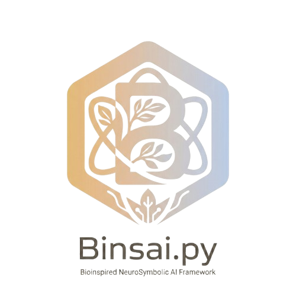
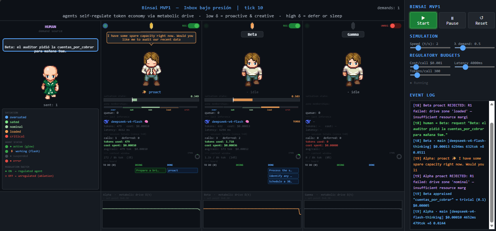

<p align="center">
  
</p>

<h1 align="center">Binsai.PY</h1>

<p align="center">
  
  <br>
  <sub><i>MVP1: 3 agents (Alpha, Beta, Gamma) regulated by δ_metabolic. Green = active, Red = suspended.</i></sub>
</p>

<p align="center">
  <a href="#english">English</a> · <a href="#español">Español</a>
</p>

<p align="center">
  <a href="https://pypi.org/project/binsai/"></a>
  <a href="https://github.com/codewithpatelo/binsai/blob/main/LICENSE"></a>
</p>

---

<a id="english"></a>

## English

**Bio-Inspired Neuro-Symbolic AI — give agents motivations, not just capabilities**

> *Binsai is an interoperable Python substrate for building situated, event-driven and self-regulating AI agents.*

**Binsai** is a regulatory harness for existing agent frameworks (LangGraph, AutoGen, CrewAI, OpenClaw). It adds motivations and internal self-state without forcing you to abandon your current stack.

Instead of only asking what an agent can do, Binsai helps decide **why, when, and whether it should act**.

**Current version**: 0.0.1 · **Status**: MVP 1 "Hungry Agents" ✅ — [See demo](examples/mvp1_hungry/)

---

## Research lineage

Binsai is the 4th iteration of a research program that asks: *what makes agents act?*

| Year | Work | Venue | What we learned |
|---|---|---|---|
| 2019 | [AopifyJS](https://github.com/codewithpatelo/aopifyjs) | Springer CCIS | FIPA-based declarative agents; roadmap already included "homeostatic motives" |
| 2026 | Pro-Action Γ (n=6) | ICML 2026 LatinX in AI Workshop | Full multi-subsystem operator; feasibility proven with 6 drives in iterated prisoner's dilemma, but 6 drives = over-engineering |
| 2026 | Pro-Action Γ Reduced (n=1) | NLP-School South America (poster) | Single-drive regulation in adversarial debate; emergent behavior, but regulation uncorrelated with collapse reduction → discovered the *satiety-signal problem* |
| 2026 | Pro-Action Γ (n=2) | LatinX in AI Workshop @ NeurIPS 2026 (pending review) | Two drives with fuzzy criticality zones; identified the **redundancy argument**: if a scalar estimator exists, estimate-then-optimize beats regulation. Γ only makes sense where scalarization is impossible. |
| 2026 | **Binsai.PY** | RSLA 2026 | Parameterizable simulation substrate; metabolic drive demo; **antagonistic tensions** scenario |

### The framing shift: homeostasis is NOT competing with optimization

The latest paper (Pro-Action Γ n=2, LatinX in AI Workshop @ NeurIPS 2026, pending review) found something uncomfortable but important: **when a scalar estimator of the state exists, estimating and optimizing dominates regulation.** This is not a defect of Γ — it's a structural fact. Regulation only makes sense where you *cannot* scalarize without choosing an arbitrary exchange rate between incommensurable objectives.

This is where **agent operations** comes in: context budget, token cost, tool rate limits, latency, error rate, safety margin. These are **genuinely antagonistic** — you can't reduce "how many tokens is one less error worth?" to a single number without making an arbitrary choice. The goal is not to maximize a scalar reward but to **maintain multiple variables within viable ranges indefinitely.**

## Why Binsai exists

### The problem: motivation is usually external

Modern agent frameworks make LLMs more capable by adding tools, memory, workflows, and communication protocols. But motivation is usually external: a graph, supervisor, or queue decides when the agent acts.

### The proposal: a bio-inspired regulatory substrate

Binsai adds an internal regulatory layer: drives, needs, set-points, deficits, and adaptive intervention policies. It draws from cognitive neuroscience, cybernetics (Stafford Beer), and systemic materialism (Bunge-Romero).

Binsai is **not** a competitor to LangGraph, AutoGen, or CrewAI. It is a regulatory substrate that gives them internal motivational dynamics — helping decide *why, when, and whether* an agent should act.

---

## Installation

```bash
pip install binsai
```

Or with Poetry:

```bash
poetry add binsai
```

## Quick Start

```python
from binsai import World, WorldConfig

# Deterministic simulation from seed alone
config = WorldConfig(seed=42, dry_run_llm=True)
world = World(config)

# Run 10 ticks
for _ in range(10):
    frame = world.step()
    for a in frame.agents:
        print(f"tick={frame.tick}  {a.name}: δ={a.delta}, zone={a.zone}, action={a.action}")
```

This creates 3 agents (Alpha, Beta, Gamma) with heterogeneous λ rates. Gamma starts unregulated for ablation comparison. Each tick: demands arrive, agents appraise and act, drives evolve.

Full demo: [`examples/mvp1_hungry/`](examples/mvp1_hungry/)

## Usage — four examples, from zero to plots

Each example is self-contained and runs in seconds. Copy-paste into a Python file or notebook.

### 1. The hungry person — a single drive with a custom action

A person gets hungry over time. When hunger rises, they go to the fridge and eat.
No LLM, no complex setup — just a drive, an action, and a homeostatic loop.

```python
from binsai import BinsaiAgent, Drives, Drive, Stratum
from binsai.action_registry import ActionSet, ActionSpec, _handler_satiate
import random

# A hunger drive: starts at 0.60 (hungry), set-point at 0.30 (satisfied)
hunger = Drive(name="hunger", stratum=Stratum.BIOLOGICAL,
               value=0.60, set_point=0.30,
               kappa=0.02, lambda_rate=0.008)

# Two actions: go to the fridge (satiates hunger) or idle
actions = ActionSet([
    ActionSpec(name="go_to_fridge", requires_demand=False,
               beta=-8.0, bias=-1.0,   # strongly preferred when hunger is high
               handler=_handler_satiate("hunger", amount=0.8, action_name="go_to_fridge")),
    ActionSpec(name="idle", requires_demand=False,
               beta=0.0, bias=-0.3,
               handler=lambda a,d,t,dm,df: "idle"),
])

person = BinsaiAgent(name="Alice", drives=Drives([hunger]),
                     action_set=actions, dry_run_llm=True,
                     rng=random.Random(42))
person.activate()

for tick in range(40):
    person.tick(tick)
    h = person.drives.get("hunger")
    action = person.last_action or "idle"
    marker = " ← eats!" if action == "go_to_fridge" else ""
    print(f"tick={tick:2d}  hunger={h.value:.2f}  zone={h.get_zone():10s}  {action}{marker}")
```

Output shows the classic homeostatic sawtooth: hunger drifts up → fridge → drops → drifts up → ...

### 2. The busy office — three agents under task pressure

Three accountants (Alpha, Beta, Gamma) receive tasks from a boss. Alpha and Beta
regulate their metabolic budget — they sleep when overloaded and conserve tokens.
Gamma has no regulation (ablation control). Over time, the regulated agents spend
fewer tokens while maintaining quality.

```python
from binsai import World, WorldConfig

# dry_run_llm=True means no API key needed — runs offline with synthetic LLM
world = World(WorldConfig(seed=42, dry_run_llm=True))

# Run 200 ticks, collect telemetry
log = world.run(200)
df = log.to_dataframe()

# Compare regulated vs unregulated
last = df.sort_values("tick").groupby("agent").last()
print(last[["session_tokens", "session_cost_usd", "session_deferred"]])

# Export for analysis
log.save_jsonl("office_simulation.jsonl")
```

### 3. The indecisive operator — antagonistic tensions

Two drives pull in opposite directions. **Processing tasks** clears the backlog
but fills the context window (costs tokens). **Compressing context** frees the
window but drops pending work. Neither extreme strategy works — only the
homeostatic middle ground keeps both variables in viable ranges.

```python
from binsai import Drive, Stratum
import random

ctx = Drive(name="context_fill", stratum=Stratum.TECHNICAL,
            value=0.30, set_point=0.30, kappa=0.02, lambda_rate=0.005)
bl  = Drive(name="task_backlog", stratum=Stratum.TECHNICAL,
            value=0.30, set_point=0.30, kappa=0.02, lambda_rate=0.004)

ctx_traj, bl_traj = [], []
for tick in range(300):
    ctx.update(tick); bl.update(tick)
    # Act on whichever drive is farther from set-point
    if abs(ctx.value - 0.30) > abs(bl.value - 0.30) and ctx.value > 0.30:
        ctx.satiate(0.5); bl.deplete(0.02)    # compress → frees ctx, drops backlog
    elif bl.value > 0.30:
        bl.satiate(0.4); ctx.deplete(0.05)    # process → clears backlog, fills ctx
    ctx_traj.append(ctx.value); bl_traj.append(bl.value)

import numpy as np
corr = np.corrcoef(ctx_traj[50:], bl_traj[50:])[0, 1]
print(f"Correlation: {corr:.3f}  — negative = genuine antagonistic tension")
print(f"Context fill range:  {min(ctx_traj):.3f}–{max(ctx_traj):.3f}")
print(f"Task backlog range:  {min(bl_traj):.3f}–{max(bl_traj):.3f}")
# Both stay within ~0.25–0.35 — tightly around set-point, without scalarizing
```

### 4. The data scientist — run, export, plot

```python
from binsai import World, WorldConfig

world = World(WorldConfig(seed=42, dry_run_llm=True))
log = world.run(300)

# Export
log.save_jsonl("results.jsonl")
log.save_csv("results.csv")
df = log.to_dataframe()

# Plot (requires matplotlib — pip install binsai[analysis])
from binsai.report import plot_trajectories, plot_kpi_comparison
plot_trajectories(log)
plot_kpi_comparison(log)
```

All four examples are also available as a [Colab notebook](notebooks/binsai_quickstart.ipynb).

---

### MVP1: What works now

This release is **MVP1 — Hungry Agent**. It implements the metabolic drive layer (Bunge S1) with:

- **One active drive**: `metabolic` — regulates when the agent sleeps, acts fast, acts slow, defers, or goes idle.
- **FIPA lifecycle**: `INITIATED → ACTIVE → SUSPENDED → ACTIVE` with causal transitions.
- **Sleep/consolidation**: When metabolic deficit exceeds threshold, agent suspends; wakes when recovered AND queue is empty.
- **State injection**: Regulatory state (δ, zone) is embedded in LLM prompts so the model reads its own "physiology".
- **Symbolic pre-check**: A minimal rule-checker gates proactive actions based on drive zone and queue size.

**What is NOT in MVP1**: The other 9 canonical drives do not yet affect behavior. Memory is native bounded working memory only (no LangGraph/LlamaIndex/Mem0 adapters yet). Neuro-symbolic layer is a rule-checker, not yet DeLP/AHP/TOPSIS.

---

## What makes Binsai different

### Stratified drives

Since 2019, the [AopifyJS roadmap](https://github.com/codewithpatelo/aopifyjs) included:
> "Homeostatic Motives system"

Binsai now implements this with philosophical grounding: **10 canonical drives** across 6 ontological levels (Bunge-Romero):

- **S1 Material**: `δ_metabolic` (tokens, energy, latency) — **MVP 1**
- **S3 Biological**: `δ_safety`, `δ_epistemic`, `δ_coherence`, `δ_competence` — **MVP 2**
- **S4 Technical**: `δ_artifact_integrity` (Safe AI), `δ_niche_construction` (Engels/Lewontin)
- **S5 Social**: `δ_relatedness`, `δ_autonomy`
- **S6 Technological**: `δ_meaning` (purpose)

Each drive has set-points, decay rates, and **fuzzy sigmoid activation** (no hard thresholds). Per Driveplexity A2: `D(δ) = (δ · σ(k·δ))²`.

### Tri-process arbitration

Inspired by Stanovich (Type 1/2/3) and our Γ paper: the agent decides between fast/slow/abstain/sleep routes based on its internal regulatory state, not just the input.

### State-regulated prompting

The Γ paper introduces **RSVI** (Regulatory State Verbalized Interoception): numerical regulatory state is verbalized into the LLM prompt as decision context, without directly prescribing actions. MVP1 embeds drive state (δ, zone memberships) into the system prompt before every LLM call. The LLM reads its own "physiology" and self-regulates reasoning depth. Future MVPs will generalize this to the full Γ operator.

### Lego memory

The brain distinguishes working, episodic, semantic, and procedural memory. Binsai MVP1 provides a native bounded working memory (7 items) with LLM-based consolidation during sleep. Future MVPs will add episodic/semantic backends and optional adapters.

### Neuro-symbolic layer

A minimal symbolic pre-commit check gates proactive actions based on drive zone and queue size (MVP1). Future MVPs will integrate defeasible argumentation (DeLP), multi-criteria aggregation (AHP), and ranking (TOPSIS).

---

## Demos (pixel-art)

Each MVP ships with a visual demo using Phaser 3:

| MVP | Demo | What it shows |
|-----|------|---------------|
| 1 | [Hungry Agents](examples/mvp1_hungry/) | `δ_metabolic` (S1 Bunge) + dummy human + FIPA lifecycle + fuzzy sigmoid |
| 2 | Curious Agent (upcoming) | All S3 drives: `δ_safety`, `δ_epistemic`, `δ_coherence`, `δ_competence` |
| 3 | Social Agent (upcoming) | S5 drives: `δ_relatedness`, `δ_autonomy` |
| 4 | Reflective Agent (upcoming) | Tri-process arbitrator (Γ operator) |
| 5 | Operator Demos (upcoming) | Driveplexity + Γ running inside Binsai |
| 6 | World Model + VSM (upcoming) | OntologicalGraph + recursion |

---

## Documentation

📚 [Full documentation](https://binsai.readthedocs.io) *(coming soon)*

---

## Related Papers

- **Pro-Action Γ (n=6)** — ICML 2026 LatinX in AI Workshop: Full multi-subsystem regulatory operator; feasibility in iterated prisoner's dilemma
- **Pro-Action Γ Reduced (n=1)** — NLP-School South America 2026 (poster): Single-drive regulation; discovered the satiety-signal problem
- **Pro-Action Γ (n=2)** — LatinX in AI Workshop @ NeurIPS 2026 (pending review): Two drives + fuzzy criticality zones; identified the redundancy argument
- **AopifyJS** — Springer CCIS, 2019: FIPA-based declarative agent programming — the architectural precursor

---

## Use Cases

### For agent developers

Integrate Binsai as a regulatory layer over your favorite framework. Granular control over behavior, systematic ablation, motivation debugging.

```python
from binsai import BinsaiAgent, Drives, World, WorldConfig

# Create an agent with stratified drives
agent = BinsaiAgent(name="Assistant", drives=Drives.stratified())

# The agent's metabolic drive regulates when it acts, sleeps, or defers
```

### For academic research

Reproducible science with papers that include Binsai code. Every prompting technique is versioned and logged.

### For industry (regulated, health, customer support)

Auditability: every decision leaves a trace of which drives conditioned it. Symbolic pre-checks provide lightweight justification for critical domains.

---

## Comparison with other frameworks

| Framework | Focus | Does Binsai complement it? |
|-----------|-------|---------------------------|
| LangGraph | Control flow graphs | Yes, as a regulatory layer on top |
| AutoGen | Multi-agent conversation | Yes, as internal state for each agent |
| CrewAI | Task delegation | Yes, as motivation for each crew member |
| OpenClaw | Symbolic reasoning | Yes, we integrate its symbolic layer |

**We don't compete**: Binsai is the *substrate*, they are the *framework*.

---

## Lineage

This project evolves from:
- [AopifyJS](https://github.com/codewithpatelo/aopifyjs) (2019, FIPA/declarative agents in Node.js) — Springer CCIS
- **Pro-Action Γ (n=6)** — ICML 2026 LatinX in AI Workshop — full operator, feasibility
- **Pro-Action Γ Reduced (n=1)** — NLP-School 2026 poster — satiety-signal problem
- **Pro-Action Γ (n=2)** — LatinX in AI Workshop @ NeurIPS 2026 (pending review) — fuzzy zones + redundancy argument
- **Binsai.PY** — RSLA 2026 — parameterizable simulation substrate

---

## Contributing

See [CONTRIBUTING.md](CONTRIBUTING.md)

Discord: [discord.gg/binsai](https://discord.gg/binsai) *(coming soon)*

---

## Package roadmap

Binsai ships incrementally through six MVPs, each adding a Bunge ontological level:

- [x] **MVP 1 — Hungry Agents**: `δ_metabolic` (S1), FIPA lifecycle, fuzzy sigmoid activation, sleep/consolidation, ablation mode
- [ ] **MVP 2 — Curious Agent**: `δ_safety`, `δ_epistemic`, `δ_coherence`, `δ_competence` (S3), episodic + semantic memory
- [ ] **MVP 3 — Social Agent**: `δ_relatedness`, `δ_autonomy` (S5), FIPA communicative acts, multi-agent EventBus
- [ ] **MVP 4 — Reflective Agent**: Tri-process arbitrator (Γ), SAM/HPA hormonal delays, metacognition, ask/wait/act/back-off
- [ ] **MVP 5 — Operator Demos**: Driveplexity + Γ operators ported into Binsai, `δ_niche_construction`, `δ_artifact_integrity` (S4), `δ_meaning` (S6)
- [ ] **MVP 6 — World Model + VSM**: OntologicalGraph (E, R, M, V, C), recursive VSM agents, neuro-symbolic wrappers (DeLP/AAF/AHP/TOPSIS)
- [ ] **v0.1.0**: PyPI release, Zenodo DOI, full documentation

---

## License

GNU General Public License v3.0 — see [LICENSE](LICENSE)

Copyright (C) 2026 Patricio Gerpe

---

> *"Next-generation intelligent agents will not emerge solely from scaling predictive models, but from coupling generative models with regulatory substrates capable of managing needs, resources, memory, coherence, and social relationships under thermodynamic constraints."*

---

<a id="español"></a>

## Español

**IA Neuro-Simbólica Bio-Inspirada — dale a los agentes motivaciones, no solo capacidades**

> *Binsai es un sustrato Python interoperable para construir agentes de IA situados, orientados a eventos y autorregulados.*

**Binsai** agrega motivaciones y estado regulatorio interno a frameworks existentes (LangGraph, AutoGen, CrewAI, OpenClaw), sin forzar a abandonar el stack actual.

En lugar de preguntar solo qué puede hacer un agente, Binsai ayuda a decidir **por qué, cuándo y si debe actuar**.

**Versión actual**: 0.0.1 · **Estado**: MVP 1 "Agentes Hambrientos" ✅

---

## Linaje de investigación

Binsai es la 4ta iteración de un programa de investigación que pregunta: *¿qué mueve a los agentes a actuar?*

| Año | Trabajo | Venue | Qué aprendimos |
|---|---|---|---|
| 2019 | [AopifyJS](https://github.com/codewithpatelo/aopifyjs) | Springer CCIS | Agentes declarativos FIPA; el roadmap ya incluía "motivos homeostáticos" |
| 2026 | Pro-Action Γ (n=6) | ICML 2026 LatinX in AI Workshop | Operador multi-subsistema completo; factibilidad con 6 drives en dilema del prisionero iterado, pero 6 drives = sobreingeniería |
| 2026 | Pro-Action Γ Reducido (n=1) | NLP-School Sudamérica (poster) | Regulación mono-drive en debate adversarial; comportamiento emergente, pero la regulación no correlacionó con la reducción de colapso → descubrimos el *problema de señal de saciedad* |
| 2026 | Pro-Action Γ (n=2) | LatinX in AI Workshop @ NeurIPS 2026 (pendiente de revisión) | Dos drives con zonas fuzzy de criticidad; identificamos el **argumento de redundancia**: si existe un estimador escalar del estado, estimar-y-optimizar domina a la regulación. Γ solo tiene sentido donde la escalarización es imposible. |
| 2026 | **Binsai.PY** | RSLA 2026 | Sustrato de simulación parametrizable; demo de drive metabólico; escenario de **tensiones antagónicas** |

### El cambio de framing: la homeostasis NO compite con la optimización

El último paper (Pro-Action Γ n=2, LatinX in AI Workshop @ NeurIPS 2026, pendiente de revisión) encontró algo incómodo pero importante: **cuando existe un estimador escalar del estado, estimar y optimizar domina a la regulación.** Esto no es un defecto de Γ — es un hecho estructural. La regulación solo tiene sentido donde *no se puede* escalarizar sin elegir un tipo de cambio arbitrario entre objetivos inconmensurables.

Ahí entra la **operación de agentes**: presupuesto de contexto, costo por token, rate limits de herramientas, latencia, tasa de error, margen de seguridad. Son **genuinamente antagónicos** — no se puede reducir "¿cuántos tokens vale evitar un error?" a un solo número sin elegir arbitrariamente. El objetivo no es maximizar una recompensa escalar sino **mantener múltiples variables dentro de rangos viables indefinidamente.**

---

## ¿Por qué existe Binsai?

### El problema: la motivación suele ser externa

Los frameworks modernos hacen a los LLMs más capaces agregando herramientas, memoria, flujos de trabajo y protocolos. Pero la motivación suele ser externa: un grafo, supervisor o cola decide cuándo actúa el agente.

### La propuesta: un sustrato regulatorio bio-inspirado

Binsai agrega una capa regulatoria interna: drives, necesidades, set-points, déficits y políticas de intervención adaptativas. Se inspira en neurociencia cognitiva, cibernética (Stafford Beer) y materialismo sistémico (Bunge-Romero).

Binsai **no** compite con LangGraph, AutoGen o CrewAI. Es un sustrato regulatorio que les da dinámicas motivacionales internas — ayudando a decidir *por qué, cuándo y si* un agente debe actuar.

---

## Instalación

```bash
pip install binsai
```

O con Poetry:

```bash
poetry add binsai
```

## Inicio rápido

```python
from binsai import World, WorldConfig

# Simulación determinista solo con la semilla
config = WorldConfig(seed=42, dry_run_llm=True)
world = World(config)

# Ejecutar 10 ticks
for _ in range(10):
    frame = world.step()
    for a in frame.agents:
        print(f"tick={frame.tick}  {a.name}: δ={a.delta}, zona={a.zone}, acción={a.action}")
```

Esto crea 3 agentes (Alpha, Beta, Gamma) con λ heterogéneas. Gamma arranca sin regulación para comparación por ablación. Cada tick: llegan demandas, los agentes evalúan y actúan, los drives evolucionan.

## Uso — cuatro ejemplos, de cero a gráficos

Cada ejemplo es autocontenido y corre en segundos. Copiá y pegá en un archivo Python o notebook.

### 1. La persona con hambre — un solo drive con una acción personalizada

Una persona tiene hambre con el tiempo. Cuando el hambre sube, va a la heladera
y come. Sin LLM, sin configuración compleja — solo un drive, una acción y un
lazo homeostático.

```python
from binsai import BinsaiAgent, Drives, Drive, Stratum
from binsai.action_registry import ActionSet, ActionSpec, _handler_satiate
import random

# Un drive de hambre: arranca en 0.60 (hambriento), set-point en 0.30 (saciado)
hambre = Drive(name="hambre", stratum=Stratum.BIOLOGICAL,
               value=0.60, set_point=0.30,
               kappa=0.02, lambda_rate=0.008)

# Dos acciones: ir a la heladera (sacia el hambre) o no hacer nada
acciones = ActionSet([
    ActionSpec(name="ir_a_la_heladera", requires_demand=False,
               beta=-8.0, bias=-1.0,   # muy preferida cuando el hambre es alta
               handler=_handler_satiate("hambre", amount=0.8, action_name="ir_a_la_heladera")),
    ActionSpec(name="no_hacer_nada", requires_demand=False,
               beta=0.0, bias=-0.3,
               handler=lambda a,d,t,dm,df: "idle"),
])

persona = BinsaiAgent(name="Alicia", drives=Drives([hambre]),
                      action_set=acciones, dry_run_llm=True,
                      rng=random.Random(42))
persona.activate()

for tick in range(40):
    persona.tick(tick)
    h = persona.drives.get("hambre")
    accion = persona.last_action or "idle"
    marca = " ← come!" if accion == "ir_a_la_heladera" else ""
    print(f"tick={tick:2d}  hambre={h.value:.2f}  zona={h.get_zone():10s}  {accion}{marca}")
```

La salida muestra el clásico diente de sierra homeostático: el hambre sube →
heladera → baja → sube → ...

### 2. La oficina ocupada — tres agentes bajo presión de tareas

Tres contadores (Alpha, Beta, Gamma) reciben tareas de un jefe. Alpha y Beta
regulan su presupuesto metabólico — duermen cuando están sobrecargados y conservan
tokens. Gamma no tiene regulación (control por ablación). Con el tiempo, los
agentes regulados gastan menos tokens manteniendo la calidad.

```python
from binsai import World, WorldConfig

# dry_run_llm=True corre sin API key — LLM sintético offline
mundo = World(WorldConfig(seed=42, dry_run_llm=True))

# Ejecutar 200 ticks, recolectar telemetría
log = mundo.run(200)
df = log.to_dataframe()

# Comparar regulado vs no regulado
ultimo = df.sort_values("tick").groupby("agent").last()
print(ultimo[["session_tokens", "session_cost_usd", "session_deferred"]])

# Exportar para análisis
log.save_jsonl("simulacion_oficina.jsonl")
```

### 3. El operador indeciso — tensiones antagónicas

Dos drives tiran en direcciones opuestas. **Procesar tareas** vacía el backlog
pero llena la ventana de contexto (cuesta tokens). **Comprimir contexto** libera
la ventana pero descarta trabajo pendiente. Ninguna estrategia extrema funciona
— solo el punto medio homeostático mantiene ambas variables en rango viable.

```python
from binsai import Drive, Stratum
import random

ctx = Drive(name="ventana_contexto", stratum=Stratum.TECHNICAL,
            value=0.30, set_point=0.30, kappa=0.02, lambda_rate=0.005)
bl  = Drive(name="tareas_pendientes", stratum=Stratum.TECHNICAL,
            value=0.30, set_point=0.30, kappa=0.02, lambda_rate=0.004)

ctx_traj, bl_traj = [], []
for tick in range(300):
    ctx.update(tick); bl.update(tick)
    # Actuar sobre el drive más alejado de su set-point
    if abs(ctx.value - 0.30) > abs(bl.value - 0.30) and ctx.value > 0.30:
        ctx.satiate(0.5); bl.deplete(0.02)    # comprimir → libera ctx, pierde tareas
    elif bl.value > 0.30:
        bl.satiate(0.4); ctx.deplete(0.05)    # procesar → vacía backlog, llena ctx
    ctx_traj.append(ctx.value); bl_traj.append(bl.value)

import numpy as np
corr = np.corrcoef(ctx_traj[50:], bl_traj[50:])[0, 1]
print(f"Correlación: {corr:.3f}  — negativa = tensión antagónica genuina")
print(f"Rango contexto:     {min(ctx_traj):.3f}–{max(ctx_traj):.3f}")
print(f"Rango tareas pend.: {min(bl_traj):.3f}–{max(bl_traj):.3f}")
# Ambos se mantienen en ~0.25–0.35 — apretados alrededor del set-point, sin escalarizar
```

### 4. El científico de datos — ejecutar, exportar, graficar

```python
from binsai import World, WorldConfig

mundo = World(WorldConfig(seed=42, dry_run_llm=True))
log = mundo.run(300)

# Exportar
log.save_jsonl("resultados.jsonl")
log.save_csv("resultados.csv")
df = log.to_dataframe()

# Graficar (requiere matplotlib — pip install binsai[analysis])
from binsai.report import plot_trajectories, plot_kpi_comparison
plot_trajectories(log)
plot_kpi_comparison(log)
```

Los cuatro ejemplos también están disponibles como [notebook de Colab](notebooks/binsai_quickstart.ipynb).

---

### MVP1: Qué funciona ahora

Este release es **MVP1 — Agente Hambriento**. Implementa la capa de drive metabólico (Bunge S1):

- **Un drive activo**: `metabolic` — regula cuándo el agente duerme, actúa rápido, lento, difiere o está inactivo.
- **Ciclo FIPA**: `INITIATED → ACTIVE → SUSPENDED → ACTIVE` con transiciones causales.
- **Sueño/consolidación**: Cuando el déficit metabólico excede el umbral, el agente se suspende; despierta cuando se recupera Y la cola está vacía.
- **Inyección de estado**: El estado regulatorio (δ, zona) se incrusta en los prompts del LLM para que el modelo lea su propia "fisiología".
- **Pre-check simbólico**: Un verificador de reglas mínimo controla acciones proactivas según zona y tamaño de cola.

**Qué NO está en MVP1**: Los otros 9 drives canónicos no afectan el comportamiento. La memoria es nativa de trabajo limitada (sin adapters para LangGraph/LlamaIndex/Mem0). La capa neuro-simbólica es un verificador de reglas, no DeLP/AHP/TOPSIS todavía.

---

## Qué hace diferente a Binsai

### Drives estratificados

Desde 2019, el [roadmap de AopifyJS](https://github.com/codewithpatelo/aopifyjs) incluía:
> "Homeostatic Motives system"

Binsai implementa esto con fundamento filosófico: **10 drives canónicos** en 6 niveles ontológicos (Bunge-Romero):

- **S1 Material**: `δ_metabolic` (tokens, energía, latencia) — **MVP 1**
- **S3 Biológico**: `δ_safety`, `δ_epistemic`, `δ_coherence`, `δ_competence` — **MVP 2**
- **S4 Técnico**: `δ_artifact_integrity` (Safe AI), `δ_niche_construction` (Engels/Lewontin)
- **S5 Social**: `δ_relatedness`, `δ_autonomy`
- **S6 Tecnológico**: `δ_meaning` (propósito)

Cada drive tiene set-points, tasas de decaimiento configurables y **activación sigmoide difusa** (sin umbrales duros).

### Arbitraje tri-proceso

Inspirado en Stanovich (Tipo 1/2/3) y nuestro paper de Γ: el agente decide entre rutas rápido/lento/abstenerse/dormir basado en su estado regulatorio interno, no solo en el input.

### Prompting regulado por estado

El paper de Γ introduce **RSVI** (Regulatory State Verbalized Interoception): el estado regulatorio numérico se verbaliza en el prompt del LLM como contexto de decisión, sin prescribir acciones directamente. MVP1 incrusta el estado del drive (δ, membresías de zona) en el system prompt antes de cada llamada al LLM.

### Memoria Lego

El cerebro distingue memoria de trabajo, episódica, semántica y procedural. Binsai MVP1 provee memoria de trabajo nativa limitada (7 ítems) con consolidación basada en LLM durante el sueño.

### Capa neuro-simbólica

Un pre-commit simbólico mínimo controla acciones proactivas según zona del drive y tamaño de cola (MVP1). Futuros MVPs integrarán argumentación rebatible (DeLP), agregación multicriterio (AHP) y ranking (TOPSIS).

---

## Demos (pixel-art)

Cada MVP incluye una demo visual con Phaser 3:

| MVP | Demo | Qué muestra |
|-----|------|-------------|
| 1 | [Hungry Agents](examples/mvp1_hungry/) | `δ_metabolic` (S1 Bunge) + dummy human + ciclo FIPA + sigmoide difusa |
| 2 | Curious Agent (próximamente) | Drives S3: `δ_safety`, `δ_epistemic`, `δ_coherence`, `δ_competence` |
| 3 | Social Agent (próximamente) | Drives S5: `δ_relatedness`, `δ_autonomy` |
| 4 | Reflective Agent (próximamente) | Árbitro tri-proceso (Γ) |
| 5 | Operator Demos (próximamente) | Γ corriendo dentro de Binsai |
| 6 | World Model + VSM (próximamente) | Grafo ontológico + recursión |

---

## Papers relacionados

- **Pro-Action Γ (n=6)** — ICML 2026 LatinX in AI Workshop: Operador regulatorio multi-subsistema completo; factibilidad en dilema del prisionero iterado
- **Pro-Action Γ Reducido (n=1)** — NLP-School Sudamérica 2026 (poster): Regulación mono-drive; descubrimiento del problema de señal de saciedad
- **Pro-Action Γ (n=2)** — LatinX in AI Workshop @ NeurIPS 2026 (pendiente de revisión): Dos drives + zonas fuzzy de criticidad; identificado el argumento de redundancia
- **AopifyJS** — Springer CCIS, 2019: Programación declarativa de agentes basada en FIPA — el precursor arquitectónico

---

## Casos de uso

### Para desarrolladores de agentes

Integrá Binsai como capa regulatoria sobre tu framework favorito. Control granular del comportamiento, ablación sistemática, depuración de motivaciones.

```python
from binsai import BinsaiAgent, Drives, World, WorldConfig

agent = BinsaiAgent(name="Assistant", drives=Drives.stratified())
# El drive metabólico regula cuándo actúa, duerme o difiere
```

### Para investigación académica

Ciencia reproducible con papers que incluyen código de Binsai. Cada técnica de prompting está versionada y registrada.

### Para industria (regulado, salud, atención al cliente)

Auditabilidad: cada decisión deja traza de qué drives la condicionaron. Pre-checks simbólicos proveen justificación ligera para dominios críticos.

---

## Comparación con otros frameworks

| Framework | Foco | ¿Binsai lo complementa? |
|-----------|------|------------------------|
| LangGraph | Grafos de control de flujo | Sí, como capa regulatoria encima |
| AutoGen | Conversación multi-agente | Sí, como estado interno de cada agente |
| CrewAI | Delegación de tareas | Sí, como motivación de cada miembro |
| OpenClaw | Razonamiento simbólico | Sí, integramos su capa simbólica |

**No competimos**: Binsai es el *sustrato*, ellos son el *framework*.

---

## Linaje

Este proyecto evoluciona de:
- [AopifyJS](https://github.com/codewithpatelo/aopifyjs) (2019, agentes declarativos FIPA en Node.js) — Springer CCIS
- **Pro-Action Γ (n=6)** — ICML 2026 LatinX in AI Workshop — operador completo, factibilidad
- **Pro-Action Γ Reducido (n=1)** — NLP-School 2026 poster — problema de señal de saciedad
- **Pro-Action Γ (n=2)** — LatinX in AI Workshop @ NeurIPS 2026 (pendiente de revisión) — zonas fuzzy + argumento de redundancia
- **Binsai.PY** — RSLA 2026 — sustrato de simulación parametrizable

---

## Contribuir

Ver [CONTRIBUTING.md](CONTRIBUTING.md)

---

## Roadmap

Binsai se publica incrementalmente en seis MVPs, cada uno agregando un nivel ontológico de Bunge:

- [x] **MVP 1 — Agentes Hambrientos**: `δ_metabolic` (S1), ciclo FIPA, activación sigmoide difusa, sueño/consolidación, modo ablación
- [ ] **MVP 2 — Agente Curioso**: `δ_safety`, `δ_epistemic`, `δ_coherence`, `δ_competence` (S3), memoria episódica + semántica
- [ ] **MVP 3 — Agente Social**: `δ_relatedness`, `δ_autonomy` (S5), actos comunicativos FIPA, EventBus multi-agente
- [ ] **MVP 4 — Agente Reflexivo**: Árbitro tri-proceso (Γ), demoras hormonales SAM/HPA, metacognición
- [ ] **MVP 5 — Demos de Operadores**: Γ corriendo dentro de Binsai, `δ_niche_construction`, `δ_artifact_integrity` (S4), `δ_meaning` (S6)
- [ ] **MVP 6 — Modelo de Mundo + VSM**: Grafo ontológico (E, R, M, V, C), agentes VSM recursivos, wrappers neuro-simbólicos (DeLP/AAF/AHP/TOPSIS)
- [ ] **v0.1.0**: release PyPI, DOI Zenodo, documentación completa

---

## Licencia

GNU General Public License v3.0 — ver [LICENSE](LICENSE)

Copyright (C) 2026 Patricio Gerpe

---

> *"La próxima generación de agentes inteligentes no emergerá solamente de escalar modelos predictivos, sino de acoplar modelos generativos con sustratos regulatorios capaces de administrar necesidades, recursos, memoria, coherencia y relaciones sociales bajo restricciones termodinámicas."*
