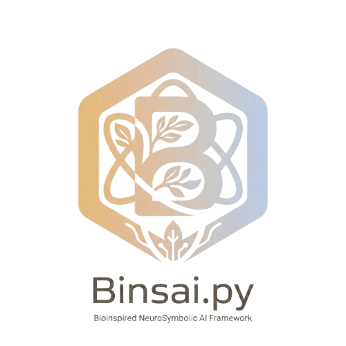
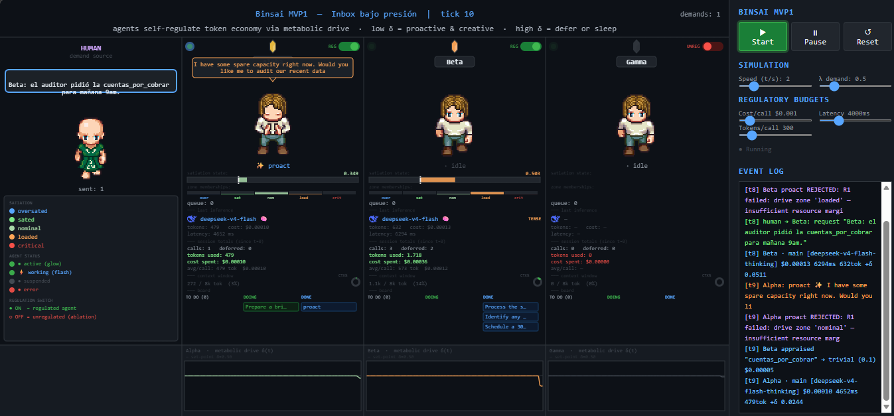

<p align="center">
  
</p>

<h1 align="center">Binsai.PY</h1>

<p align="center">
  
  <br>
  <sub><i>MVP1: 3 agents (Alpha, Beta, Gamma) regulated by δ_metabolic. Violet = waiting, Blue = active task, Gray = suspended, Red = critical.</i></sub>
</p>

<p align="center">
  <a href="#english">English</a> · <a href="#español">Español</a>
</p>

<p align="center">
  <a href="https://pypi.org/project/binsai/"></a>
  <a href="https://github.com/codewithpatelo/binsai/blob/main/LICENSE"></a>
</p>

---

<a id="english"></a>

## English

**Bio-Inspired Neuro-Symbolic AI — give agents motivations, not just capabilities**

> *Binsai is an interoperable Python substrate for building situated, event-driven and self-regulating AI agents.*

**Binsai** is a regulatory harness for existing agent frameworks (LangGraph, AutoGen, CrewAI, OpenClaw). It adds motivations and internal self-state without forcing you to abandon your current stack.

Instead of only asking what an agent can do, Binsai helps decide **why, when, and whether it should act**.

**Current version**: 0.2.0 · **Status**: MVP 1 "Hungry Agents" ✅ — `binsai run mvp1 --no-llm`

---

## Research lineage

Binsai is the 4th iteration of a research program that asks: *what makes agents act?*

| Year | Work | Venue | What we learned |
|---|---|---|---|
| 2019 | [AopifyJS](https://github.com/codewithpatelo/aopifyjs) | Springer CCIS | FIPA-based declarative agents; roadmap already included "homeostatic motives" |
| 2026 | Pro-Action Γ (n=6) | ICML 2026 LatinX in AI Workshop | Full multi-subsystem operator; feasibility proven with 6 drives in iterated prisoner's dilemma, but 6 simultaneous drives proved hard to interpret — later work reduced to n=1 and n=2 |
| 2026 | Pro-Action Γ Reduced (n=1) | NLP-School South America (poster) | Single-drive regulation in adversarial debate; emergent behavior, but regulation uncorrelated with collapse reduction → discovered the *satiety-signal problem* |
| 2026 | Pro-Action Γ (n=2) | arXiv (pending upload) | Two drives with fuzzy criticality zones; identified the **redundancy argument**: if a scalar estimator exists, estimate-then-optimize beats regulation. Γ only makes sense where scalarization is impossible. |
| 2026 | **Binsai.PY** | RSLA 2026 | Parameterizable simulation substrate; metabolic drive demo; **antagonistic tensions** scenario |

### The framing shift: homeostasis is NOT competing with optimization

The latest paper (Pro-Action Γ n=2, arXiv pending upload) found something uncomfortable but important: **when a scalar estimator of the state exists, estimating and optimizing dominates regulation.** This is not a defect of Γ — it's a structural fact. Regulation only makes sense where you *cannot* scalarize without choosing an arbitrary exchange rate between incommensurable objectives.

This is where **agent operations** comes in: context budget, token cost, tool rate limits, latency, error rate, safety margin. These are **genuinely antagonistic** — you can't reduce "how many tokens is one less error worth?" to a single number without making an arbitrary choice. The goal is not to maximize a scalar reward but to **maintain multiple variables within viable ranges indefinitely.**

## Why Binsai exists

### The problem: motivation is usually external

Modern agent frameworks make LLMs more capable by adding tools, memory, workflows, and communication protocols. But motivation is usually external: a graph, supervisor, or queue decides when the agent acts.

### The proposal: a bio-inspired regulatory substrate

Binsai adds an internal regulatory layer: drives, set-points, deficits, and adaptive intervention policies. It draws from cognitive neuroscience and cybernetics (Stafford Beer).

Binsai is **not** a competitor to LangGraph, AutoGen, or CrewAI. It is a regulatory substrate that gives them internal motivational dynamics — helping decide *why, when, and whether* an agent should act.

Binsai is to the PAO what scikit-learn is to statistical models, and to self-regulating agents what NetLogo is to agent-based models — a library for research, not a production framework.

---

## The Proaction Operator (PAO)

Binsai implements the **PAO** (ES: *Ecuación Proacción*) — a state equation that models *viability*, not optimization. For each drive `i`, on every pulse:

```
x_i(t+1) = x_i(t) + λ_i(x_i,t) − κ_i·(x_i(t) − x_i*) + u_i(t) + Σ_j W_ij·(x_j(t) − x_j*)
```

| Term | Name | What it does |
|---|---|---|
| `x_i` | drive level | the regulated state |
| `x_i*` | set-point | theoretical harmony point |
| `λ_i` | basal drift | what happens when nothing happens (`basal_direction`: `"recover"`/`"decay"`, shaped by `drift`) |
| `κ_i` | elastic spring | pulls toward set-point; keeps the system oscillating instead of freezing at equilibrium |
| `u_i` | stimuli & actions | satiate (α>0) or perturb (α<0) the deviation |
| `W_ij` | coupling | how much another drive's deviation moves this one |

There is **no terminal objective to maximize** — only ranges to sustain. Every drive is either `push` (accumulates pressure → activates) or `pull` (protects a resource → inhibits, often by *doing* a preservation task). A minimally viable system needs at least one of each — if all drives are `pull`, the optimal policy is inaction.

Full spec (ES): [`docs/EPA.md`](docs/EPA.md)

### Algedonic zones

Each drive carries seven fuzzy bands symmetric around its set-point (`critical_superavit … equilibrium … critical_deficit`), with parametrizable centers, widths and hysteresis (`alpha_in`/`alpha_out`). Crossing a band emits `ZoneChanged`; crossing a viability limit emits `ViabilityBreached` — operational death, conjunctive over all drives.

### Observed variables: level + pace

A drive doesn't look at its level in a vacuum — it observes operational variables, each contributing two signals: **level** (how close to the limit right now) and **pace** (how fast it moves toward the limit, vs. the sustainable rate *derived from the contract window* — never hand-picked).

```python
from binsai import Drive, ObservedVariable

api_spend = ObservedVariable(
    name="api_spend", kind="budget", unit="USD",
    limit=150.0, window=11.5,                # per-shift budget window
    pacing_mode="time_to_violation",
    recovery_time=0.5,                       # MEASURED, not chosen
    reaction_time=0.1,
    monotonic=True, source="billing.api",
)

metabolic = Drive(name="metabolic", category="pull", observed=[api_spend])

api_spend.observe(t=3.0, value=60.0)    # feed a sensor sample
metabolic.update(tick=3.0)              # → metabolic.pressure, metabolic.driving_variable
```

Four contract kinds: `budget` (consumed within a window), `floor` (must not drop below), `target` (must be reached in time), `band` (must stay inside a range). Sensor gone stale or returning impossible values? `SensorInvalid` is emitted — **a variable that can't be measured is never assumed green**.

Contract values live in versioned files, not code — see [`examples/viability-contract.json`](examples/viability-contract.json) + [`viability-contract.md`](examples/viability-contract.md), loaded via `binsai.load_contract()`.

### Canonical events & subscriptions

`Pulse`, `ZoneChanged`, `PressureUpdated`, `SensorInvalid`, `ViabilityBreached`, `Satiated`, `Coupled`. Drives and agents are all emitters, and any emitter can subscribe to another's events (the vocabulary borrows from FIPA's subscribe/cancel):

```python
sub_id = drive_b.subscribe(drive_a, "ZoneChanged", handler)
drive_b.unsubscribe(sub_id)

agent.on("drive.hunger.critical_deficit", react)              # zone-specific
agent.on("ZoneChanged", audit)                                # canonical
```

### Lifecycle

`INITIATED → WAITING → ACTIVE → WAITING`, plus `SUSPENDED` and `TERMINATED` — a lifecycle inspired by FIPA's agent-management states.
`WAITING` is where the PAO decides; `ACTIVE` means a task is committed — no new decisions mid-task (avoids dithering), unless a red band or viability breach interrupts it (`interrupt_on_zone`, default `"critical"`). `TRANSIT` is reserved for future mobile agents.

> **Breaking change in 0.2.0**: the state previously called `ACTIVE` is now `WAITING` (alive, idle, PAO decides); `ACTIVE` now means *executing a committed task*.

---

## Installation

```bash
pip install binsai
```

Or with Poetry:

```bash
poetry add binsai
```

## Quick Start

```python
from binsai import World, WorldConfig

# Deterministic simulation from seed alone
config = WorldConfig(seed=42, dry_run_llm=True)
world = World(config)

# Run 10 ticks
for _ in range(10):
    frame = world.step()
    for a in frame.agents:
        print(f"tick={frame.tick}  {a.name}: δ={a.delta}, zone={a.zone}, action={a.action}")
```

This creates 3 agents (Alpha, Beta, Gamma) with heterogeneous λ rates. Gamma starts unregulated for ablation comparison. Each tick: demands arrive, agents appraise and act, drives evolve.

Visual demo: `binsai run mvp1` (add `--no-llm` for a dry run with no API key, `--ablation-off` to disable regulation). Requires `pip install binsai[web]`.

## Usage — three examples, from zero to plots

Each example is self-contained and runs in seconds. Copy-paste into a Python file or notebook.

### 1. The hungry person — a single drive with a custom action

A person gets hungry over time. When hunger rises, they go to the fridge and eat.
No LLM, no complex setup — just a drive, an action, and a homeostatic loop.

```python
from binsai import BinsaiAgent, Drives, Drive
from binsai.action_registry import ActionSet, ActionSpec, _handler_satiate
import random

# A hunger drive: starts at 0.60 (hungry), set-point at 0.30 (satisfied)
hunger = Drive(name="hunger", value=0.60, set_point=0.30,
               kappa=0.02, lambda_rate=0.008)

# Two actions: go to the fridge (satiates hunger) or idle
actions = ActionSet([
    ActionSpec(name="go_to_fridge", requires_demand=False,
               beta=+8.0, bias=-1.5,   # activates when hungry (deficit), not when full
               handler=_handler_satiate("hunger", amount=0.8, action_name="go_to_fridge", only_when_deficit=True)),
    ActionSpec(name="idle", requires_demand=False,
               beta=0.0, bias=-0.3,
               handler=lambda a,d,t,dm,df: "idle"),
])

person = BinsaiAgent(name="Alice", drives=Drives([hunger]),
                     action_set=actions, dry_run_llm=True,
                     rng=random.Random(42))
person.activate()

for tick in range(40):
    person.tick(tick)
    h = person.drives.get("hunger")
    action = person.last_action or "idle"
    marker = " ← eats!" if action == "go_to_fridge" else ""
    print(f"tick={tick:2d}  hunger={h.value:.2f}  zone={h.get_zone():10s}  {action}{marker}")
```

Output shows the classic homeostatic sawtooth: hunger drifts up → fridge → drops → drifts up → ...

### 2. Socialization — a relatedness drive that re-engages

An agent has a `relatedness` drive. When it decays (the agent feels socially
disconnected), the deficit triggers proactive re-initiation of contact — even
without an incoming message.

```python
import os
# os.environ["DEEPSEEK_API_KEY"] = "sk-..."

from binsai import World, WorldConfig, AgentConfig
from binsai.action_registry import ActionSet, ActionSpec, _handler_llm, _handler_noop

def _social_llm(action_name, satiate_amount=0.5):
    def handler(agent, drive, tick, demand, difficulty):
        r = agent.drives.get("relatedness")
        if r:
            r.satiate(satiate_amount)
        return "llm"
    return handler

social_actions = ActionSet([
    ActionSpec(name="reply", requires_demand=True, delta_cost=0.002, ticks=1,
               max_tokens=256, beta=-0.5, bias=+1.6, handler=_social_llm("reply")),
    ActionSpec(name="initiate_contact", requires_demand=False, delta_cost=0.003,
               ticks=1, max_tokens=256, beta=+6.0, bias=-1.0,
               handler=_social_llm("initiate_contact")),
    ActionSpec(name="idle", requires_demand=False, handler=_handler_noop),
])

config = WorldConfig(seed=42, dry_run_llm=("DEEPSEEK_API_KEY" not in os.environ),
    agents=[AgentConfig(name="HomeoBot", drive_names=["relatedness"],
                        drive_configs=[{"name": "relatedness", "lambda_rate": 0.010,
                                        "set_point": 0.30, "satiation_rate": 0.30}],
                        temperature=1.0)])
w = World(config)
for a in w.agents:
    a.action_set = social_actions

log = w.run(60)
df = log.to_dataframe()
print(df[df["agent"] == "HomeoBot"]["action"].value_counts())
```

### 3. The indecisive operator — antagonistic tensions

Two drives pull in opposite directions. **Processing tasks** clears the backlog
but fills the context window (costs tokens). **Compressing context** frees the
window but drops pending work. Neither extreme strategy works — only the
homeostatic middle ground keeps both variables in viable ranges.

```python
from binsai import Drive
import random

ctx = Drive(name="context_fill", value=0.30, set_point=0.30, kappa=0.02, lambda_rate=0.005)
bl  = Drive(name="task_backlog", value=0.30, set_point=0.30, kappa=0.02, lambda_rate=0.004)

ctx_traj, bl_traj = [], []
for tick in range(300):
    ctx.update(tick); bl.update(tick)
    # Act on whichever drive is farther from set-point
    if abs(ctx.value - 0.30) > abs(bl.value - 0.30) and ctx.value > 0.30:
        ctx.satiate(0.5); bl.deplete(0.02)    # compress → frees ctx, drops backlog
    elif bl.value > 0.30:
        bl.satiate(0.4); ctx.deplete(0.05)    # process → clears backlog, fills ctx
    ctx_traj.append(ctx.value); bl_traj.append(bl.value)

import numpy as np
corr = np.corrcoef(ctx_traj[50:], bl_traj[50:])[0, 1]
print(f"Correlation: {corr:.3f}  — negative = genuine antagonistic tension")
print(f"Context fill range:  {min(ctx_traj):.3f}–{max(ctx_traj):.3f}")
print(f"Task backlog range:  {min(bl_traj):.3f}–{max(bl_traj):.3f}")
# Both stay within ~0.25–0.35 — tightly around set-point, without scalarizing
```

All three examples are also available as a [Colab notebook](notebooks/binsai_quickstart.ipynb).

---

### MVP1: What works now

This release is **MVP1 — Hungry Agent**. It implements the metabolic drive layer (Bunge S1) with:

- **One active drive**: `metabolic` — regulates when the agent sleeps, acts fast, acts slow, defers, or goes idle.
- **Lifecycle**: `INITIATED → WAITING → ACTIVE → WAITING`, `WAITING ↔ SUSPENDED`, with causal transitions and red-band interrupts.
- **Sleep/consolidation**: When metabolic deficit exceeds threshold, agent suspends; wakes when recovered AND queue is empty.
- **State injection**: Regulatory state (δ, zone) is embedded in LLM prompts so the model reads its own "physiology".
- **Symbolic pre-check**: A minimal rule-checker gates proactive actions based on drive zone and queue size.

**What is NOT in MVP1**: The other 9 canonical drives do not yet affect behavior. The satiation-quality signal `g`, the action-skills catalog, and allostasis (anticipatory regulation with a world model) are open problems — see [`docs/EPA.md` §7](docs/EPA.md). Memory is native bounded working memory only (no LangGraph/LlamaIndex/Mem0 adapters yet). The symbolic pre-check is a rule-checker, not yet DeLP/AHP/TOPSIS.

---

## What makes Binsai different

### Stratified drives

Since 2019, the [AopifyJS roadmap](https://github.com/codewithpatelo/aopifyjs) included:
> "Homeostatic Motives system"

Binsai ships with **10 canonical drives** as importable presets across 6 ontological levels (Bunge-Romero). Use them as-is or create your own — they're defaults, not constraints:

- **S1 Material**: `δ_metabolic` (tokens, energy, latency) — **MVP 1**
- **S3 Biological**: `δ_safety`, `δ_epistemic`, `δ_coherence`, `δ_competence` — **MVP 2**
- **S4 Technical**: `δ_artifact_integrity` (Safe AI), `δ_niche_construction` (Engels/Lewontin)
- **S5 Social**: `δ_relatedness`, `δ_autonomy`
- **S6 Technological**: `δ_meaning` (purpose)

Each drive has set-points, decay rates, and **fuzzy sigmoid activation** (no hard thresholds).

### State-regulated prompting

The Γ paper introduces **RSVI** (Regulatory State Verbalized Interoception): numerical regulatory state is verbalized into the LLM prompt as decision context, without directly prescribing actions. MVP1 embeds drive state (δ, zone memberships) into the system prompt before every LLM call. The LLM reads its own "physiology" and self-regulates reasoning depth. Future MVPs will generalize this to the full Γ operator.

### Lego memory

The brain distinguishes working, episodic, semantic, and procedural memory. Binsai MVP1 provides a native bounded working memory (7 items) with LLM-based consolidation during sleep. Future MVPs will add episodic/semantic backends and optional adapters.

---

## Demos (pixel-art)

Each MVP ships with a visual demo using Phaser 3. The demo is an **optional install** — `pip install binsai[web]` pulls in the web extras, so a library-only install stays lean:

| MVP | Demo | What it shows |
|-----|------|---------------|
| 1 | Hungry Agents — `binsai run mvp1` | `δ_metabolic` (S1 Bunge) + dummy human + lifecycle + fuzzy sigmoid |
| 2 | Curious Agent (upcoming) | All S3 drives: `δ_safety`, `δ_epistemic`, `δ_coherence`, `δ_competence` |
| 3 | Social Agent (upcoming) | S5 drives: `δ_relatedness`, `δ_autonomy` |
| 4 | Reflective Agent (upcoming) | Γ operator arbitration |
| 5 | Operator Demos (upcoming) | Driveplexity + Γ running inside Binsai |
| 6 | World Model + VSM (upcoming) | OntologicalGraph + recursion |

---

## Documentation

📚 [Full documentation](https://binsai.readthedocs.io) *(coming soon)*

---

## Related Papers

- **Pro-Action Γ (n=6)** — ICML 2026 LatinX in AI Workshop: Full multi-subsystem regulatory operator; feasibility in iterated prisoner's dilemma
- **Pro-Action Γ Reduced (n=1)** — NLP-School South America 2026 (poster): Single-drive regulation; discovered the satiety-signal problem
- **Pro-Action Γ (n=2)** — arXiv (pending upload): Two drives + fuzzy criticality zones; identified the redundancy argument
- **AopifyJS** — Springer CCIS, 2019: FIPA-based declarative agent programming — the architectural precursor

---

## Use Cases

### For agent developers

Integrate Binsai as a regulatory layer over your favorite framework. Granular control over behavior, systematic ablation, motivation debugging.

```python
from binsai import BinsaiAgent, Drives, World, WorldConfig

# Create an agent with stratified drives
agent = BinsaiAgent(name="Assistant", drives=Drives.stratified())

# The agent's metabolic drive regulates when it acts, sleeps, or defers
```

### For academic research

Reproducible science with papers that include Binsai code. Every prompting technique is versioned and logged.

### For industry (regulated, health, customer support)

Auditability: every decision leaves a trace of which drives conditioned it. Symbolic pre-checks provide lightweight justification for critical domains.

---

## Comparison with other frameworks

| Framework | Focus | What Binsai adds on top |
|-----------|-------|------------------------|
| LangGraph | Control-flow graphs / orchestration | Drives that decide *when* a node or agent should fire — not just the graph topology |
| AutoGen | Multi-agent conversation | Internal state per agent: each agent gets drives that gate when it speaks or acts |
| CrewAI | Role-based task delegation | Motivational state per crew member: drives decide when a role acts, defers, or rests |
| OpenClaw | Personal AI assistant / multi-channel gateway | Internal drives that regulate when the assistant acts, defers, or conserves resources across channels |

**We don't compete**: Binsai is the *substrate*, they are the *framework*.

---

## Lineage

This project evolves from:
- [AopifyJS](https://github.com/codewithpatelo/aopifyjs) (2019, FIPA/declarative agents in Node.js) — Springer CCIS
- **Pro-Action Γ (n=6)** — ICML 2026 LatinX in AI Workshop — full operator, feasibility
- **Pro-Action Γ Reduced (n=1)** — NLP-School 2026 poster — satiety-signal problem
- **Pro-Action Γ (n=2)** — arXiv (pending upload) — fuzzy zones + redundancy argument
- **Binsai.PY** — RSLA 2026 — parameterizable simulation substrate

---

## Contributing

See [CONTRIBUTING.md](CONTRIBUTING.md)

Discord: [discord.gg/binsai](https://discord.gg/binsai) *(coming soon)*

---

## Package roadmap

Binsai ships incrementally through six MVPs, each adding a Bunge ontological level:

- [x] **MVP 1 — Hungry Agents**: `δ_metabolic` (S1), agent lifecycle, fuzzy sigmoid activation, sleep/consolidation, ablation mode
- [ ] **MVP 2 — Curious Agent**: `δ_safety`, `δ_epistemic`, `δ_coherence`, `δ_competence` (S3), episodic + semantic memory
- [ ] **MVP 3 — Social Agent**: `δ_relatedness`, `δ_autonomy` (S5), typed communicative acts, multi-agent EventBus
- [ ] **MVP 4 — Reflective Agent**: Γ arbitration, SAM/HPA hormonal delays, metacognition, ask/wait/act/back-off
- [ ] **MVP 5 — Operator Demos**: Driveplexity + Γ operators ported into Binsai, `δ_niche_construction`, `δ_artifact_integrity` (S4), `δ_meaning` (S6)
- [ ] **MVP 6 — World Model + VSM**: OntologicalGraph (E, R, M, V, C), recursive VSM agents, neuro-symbolic wrappers (DeLP/AAF/AHP/TOPSIS)
- [x] **v0.1.0**: PyPI release, MVP1 demo
- [x] **v0.2.0**: EPA revision — `ObservedVariable` (level + pacing), push/pull categories, hysteresis, viability contracts, agent lifecycle (`WAITING`/`ACTIVE`), canonical events, expanded ACL
- [ ] **v1.0.0**: Zenodo DOI, full documentation, quality signal `g`, skill catalog schema

---

## License

GNU General Public License v3.0 — see [LICENSE](LICENSE)

Copyright (C) 2026 Patricio Gerpe

---

> *"Next-generation intelligent agents will not emerge solely from scaling predictive models, but from coupling generative models with regulatory substrates capable of managing needs, resources, memory, coherence, and social relationships under thermodynamic constraints."*

---

<a id="español"></a>

## Español

**IA Neuro-Simbólica Bio-Inspirada — dale a los agentes motivaciones, no solo capacidades**

> *Binsai es un sustrato Python interoperable para construir agentes de IA situados, orientados a eventos y autorregulados.*

**Binsai** agrega motivaciones y estado regulatorio interno a frameworks existentes (LangGraph, AutoGen, CrewAI, OpenClaw), sin forzar a abandonar el stack actual.

En lugar de preguntar solo qué puede hacer un agente, Binsai ayuda a decidir **por qué, cuándo y si debe actuar**.

**Versión actual**: 0.2.0 · **Estado**: MVP 1 "Agentes Hambrientos" ✅ — `binsai run mvp1 --no-llm`

---

## Linaje de investigación

Binsai es la 4ta iteración de un programa de investigación que pregunta: *¿qué mueve a los agentes a actuar?*

| Año | Trabajo | Venue | Qué aprendimos |
|---|---|---|---|
| 2019 | [AopifyJS](https://github.com/codewithpatelo/aopifyjs) | Springer CCIS | Agentes declarativos FIPA; el roadmap ya incluía "motivos homeostáticos" |
| 2026 | Pro-Action Γ (n=6) | ICML 2026 LatinX in AI Workshop | Operador multi-subsistema completo; factibilidad con 6 drives en dilema del prisionero iterado, pero 6 drives simultáneos resultaron difíciles de interpretar — trabajos posteriores redujeron a n=1 y n=2 |
| 2026 | Pro-Action Γ Reducido (n=1) | NLP-School Sudamérica (poster) | Regulación mono-drive en debate adversarial; comportamiento emergente, pero la regulación no correlacionó con la reducción de colapso → descubrimos el *problema de señal de saciedad* |
| 2026 | Pro-Action Γ (n=2) | arXiv (pendiente de subida) | Dos drives con zonas fuzzy de criticidad; identificamos el **argumento de redundancia**: si existe un estimador escalar del estado, estimar-y-optimizar domina a la regulación. Γ solo tiene sentido donde la escalarización es imposible. |
| 2026 | **Binsai.PY** | RSLA 2026 | Sustrato de simulación parametrizable; demo de drive metabólico; escenario de **tensiones antagónicas** |

### El cambio de framing: la homeostasis NO compite con la optimización

El último paper (Pro-Action Γ n=2, arXiv pendiente de subida) encontró algo incómodo pero importante: **cuando existe un estimador escalar del estado, estimar y optimizar domina a la regulación.** Esto no es un defecto de Γ — es un hecho estructural. La regulación solo tiene sentido donde *no se puede* escalarizar sin elegir un tipo de cambio arbitrario entre objetivos inconmensurables.

Ahí entra la **operación de agentes**: presupuesto de contexto, costo por token, rate limits de herramientas, latencia, tasa de error, margen de seguridad. Son **genuinamente antagónicos** — no se puede reducir "¿cuántos tokens vale evitar un error?" a un solo número sin elegir arbitrariamente. El objetivo no es maximizar una recompensa escalar sino **mantener múltiples variables dentro de rangos viables indefinidamente.**

---

## ¿Por qué existe Binsai?

### El problema: la motivación suele ser externa

Los frameworks modernos hacen a los LLMs más capaces agregando herramientas, memoria, flujos de trabajo y protocolos. Pero la motivación suele ser externa: un grafo, supervisor o cola decide cuándo actúa el agente.

### La propuesta: un sustrato regulatorio bio-inspirado

Binsai agrega una capa regulatoria interna: drives, necesidades, set-points, déficits y políticas de intervención adaptativas. Se inspira en neurociencia cognitiva y cibernética (Stafford Beer).

Binsai **no** compite con LangGraph, AutoGen o CrewAI. Es un sustrato regulatorio que les da dinámicas motivacionales internas — ayudando a decidir *por qué, cuándo y si* un agente debe actuar.

Binsai es a la EPA lo que scikit-learn es a los modelos estadísticos, y a los agentes autorregulados lo que NetLogo es a los modelos basados en agentes — una librería para investigar, no un framework de producción.

---

## La Ecuación Proacción (EPA)

Binsai implementa la **EPA** — una ecuación de estados que modela *viabilidad*, no optimización. Para cada necesidad `i`, en cada pulso:

```
x_i(t+1) = x_i(t) + λ_i(x_i,t) − κ_i·(x_i(t) − x_i*) + u_i(t) + Σ_j W_ij·(x_j(t) − x_j*)
```

| Término | Nombre | Qué hace |
|---|---|---|
| `x_i` | nivel de la necesidad | el estado que se regula |
| `x_i*` | punto de equilibrio | el punto teórico de armonía |
| `λ_i` | deriva basal | qué le pasa a la necesidad si no ocurre nada (`basal_direction`: `"recover"`/`"decay"`, forma por `drift`) |
| `κ_i` | resorte elástico | tira hacia el equilibrio; mantiene la oscilación viva en vez de congelarse en el set-point |
| `u_i` | estímulos y acciones | sacia (α>0) o perturba (α<0) el desvío |
| `W_ij` | acoplamiento | cuánto el desvío de otra necesidad mueve a esta |

**No hay objetivo terminal que maximizar** — hay rangos que se sostienen. Toda necesidad es `push` (acumula presión → activa) o `pull` (protege un recurso → inhibe, muchas veces *haciendo* una tarea de preservación). Un sistema viable de mínima necesita una de cada tipo — si todas son `pull`, la política óptima es no hacer nada.

Spec completa: [`docs/EPA.md`](docs/EPA.md)

### Zonas algedónicas

Cada necesidad tiene siete bandas difusas simétricas respecto del punto de equilibrio (`critical_superavit … equilibrium … critical_deficit`), con centros, anchos e histéresis (`alpha_in`/`alpha_out`) parametrizables. Cruzar una banda emite `ZoneChanged`; cruzar el límite de viabilidad emite `ViabilityBreached` — muerte operativa, conjuntiva sobre todas las necesidades.

### Variables observadas: nivel y ritmo

Una necesidad no mira su nivel en el vacío — observa variables operativas, y cada una aporta dos señales: **nivel** (qué tan cerca del límite está ahora) y **ritmo** (a qué velocidad se acerca, vs. el ritmo sostenible *derivado del contrato y la ventana* — nunca elegido a mano).

```python
from binsai import Drive, ObservedVariable

gasto_api = ObservedVariable(
    name="gasto_api", kind="budget", unit="USD",
    limit=150.0, window=11.5,                # presupuesto por ventana
    pacing_mode="time_to_violation",
    recovery_time=0.5,                       # MEDIDO, no elegido
    reaction_time=0.1,
    monotonic=True, source="billing.api",
)

metabolico = Drive(name="metabolic", category="pull", observed=[gasto_api])

gasto_api.observe(t=3.0, value=60.0)    # muestra del sensor
metabolico.update(tick=3.0)             # → metabolico.pressure, metabolico.driving_variable
```

Cuatro tipos de contrato: `budget` (se consume dentro de una ventana), `floor` (no debe bajar del piso), `target` (hay que alcanzarlo en la ventana), `band` (debe quedar dentro de un rango). ¿Sensor vencido o valor imposible? Se emite `SensorInvalid` — **una variable que no se puede medir nunca se asume en verde**.

Los valores del contrato viven en archivos versionados, no en el código — ver [`examples/viability-contract.json`](examples/viability-contract.json) + [`viability-contract.md`](examples/viability-contract.md), cargables con `binsai.load_contract()`.

### Eventos canónicos y suscripciones

`Pulse`, `ZoneChanged`, `PressureUpdated`, `SensorInvalid`, `ViabilityBreached`, `Satiated`, `Coupled`. Necesidades y agentes son emisores, y cualquier emisor puede suscribirse a los eventos de otro (el vocabulario toma el subscribe/cancel de FIPA):

```python
sub_id = drive_b.subscribe(drive_a, "ZoneChanged", handler)
drive_b.unsubscribe(sub_id)

agent.on("drive.hunger.critical_deficit", reaccionar)         # por zona
agent.on("ZoneChanged", auditar)                              # canónico
```

### Ciclo de vida

`INITIATED → WAITING → ACTIVE → WAITING`, más `SUSPENDED` y `TERMINATED` — un ciclo inspirado en los estados de gestión de agentes de FIPA.
`WAITING` es donde la EPA decide; `ACTIVE` significa tarea comprometida — no se toman decisiones nuevas a mitad de tarea (evita el dithering), salvo que una banda roja o un cruce de viabilidad la interrumpa (`interrupt_on_zone`, default `"critical"`). `TRANSIT` queda reservado para agentes móviles.

> **Cambio breaking en 0.2.0**: el estado que antes se llamaba `ACTIVE` ahora es `WAITING` (vivo, disponible, la EPA decide); `ACTIVE` ahora significa *ejecutando una tarea comprometida*.

---

## Instalación

```bash
pip install binsai
```

O con Poetry:

```bash
poetry add binsai
```

## Inicio rápido

```python
from binsai import World, WorldConfig

# Simulación determinista solo con la semilla
config = WorldConfig(seed=42, dry_run_llm=True)
world = World(config)

# Ejecutar 10 ticks
for _ in range(10):
    frame = world.step()
    for a in frame.agents:
        print(f"tick={frame.tick}  {a.name}: δ={a.delta}, zona={a.zone}, acción={a.action}")
```

Esto crea 3 agentes (Alpha, Beta, Gamma) con λ heterogéneas. Gamma arranca sin regulación para comparación por ablación. Cada tick: llegan demandas, los agentes evalúan y actúan, los drives evolucionan.

## Uso — tres ejemplos, de cero a gráficos

Cada ejemplo es autocontenido y corre en segundos. Copiá y pegá en un archivo Python o notebook.

### 1. La persona con hambre — un solo drive con una acción personalizada

Una persona tiene hambre con el tiempo. Cuando el hambre sube, va a la heladera
y come. Sin LLM, sin configuración compleja — solo un drive, una acción y un
lazo homeostático.

```python
from binsai import BinsaiAgent, Drives, Drive
from binsai.action_registry import ActionSet, ActionSpec, _handler_satiate
import random

# Un drive de hambre: arranca en 0.60 (hambriento), set-point en 0.30 (saciado)
hambre = Drive(name="hambre", value=0.60, set_point=0.30,
               kappa=0.02, lambda_rate=0.008)

# Dos acciones: ir a la heladera (sacia el hambre) o no hacer nada
acciones = ActionSet([
    ActionSpec(name="ir_a_la_heladera", requires_demand=False,
               beta=+8.0, bias=-1.5,   # se activa con déficit, no con superávit
               handler=_handler_satiate("hambre", amount=0.8, action_name="ir_a_la_heladera", only_when_deficit=True)),
    ActionSpec(name="no_hacer_nada", requires_demand=False,
               beta=0.0, bias=-0.3,
               handler=lambda a,d,t,dm,df: "idle"),
])

persona = BinsaiAgent(name="Alicia", drives=Drives([hambre]),
                      action_set=acciones, dry_run_llm=True,
                      rng=random.Random(42))
persona.activate()

for tick in range(40):
    persona.tick(tick)
    h = persona.drives.get("hambre")
    accion = persona.last_action or "idle"
    marca = " ← come!" if accion == "ir_a_la_heladera" else ""
    print(f"tick={tick:2d}  hambre={h.value:.2f}  zona={h.get_zone():10s}  {accion}{marca}")
```

La salida muestra el clásico diente de sierra homeostático: el hambre sube →
heladera → baja → sube → ...

### 2. Socialización — un drive de relatedness que re-engagea

Un agente tiene un drive `relatedness`. Cuando decae (el agente se siente
socialmente desconectado), el déficit dispara la re-iniciación proactiva de
contacto — incluso sin un mensaje entrante.

```python
import os
# os.environ["DEEPSEEK_API_KEY"] = "sk-..."

from binsai import World, WorldConfig, AgentConfig
from binsai.action_registry import ActionSet, ActionSpec, _handler_llm, _handler_noop

def _social_llm(action_name, satiate_amount=0.5):
    def handler(agent, drive, tick, demand, difficulty):
        r = agent.drives.get("relatedness")
        if r:
            r.satiate(satiate_amount)
        return "llm"
    return handler

social_actions = ActionSet([
    ActionSpec(name="reply", requires_demand=True, delta_cost=0.002, ticks=1,
               max_tokens=256, beta=-0.5, bias=+1.6, handler=_social_llm("reply")),
    ActionSpec(name="initiate_contact", requires_demand=False, delta_cost=0.003,
               ticks=1, max_tokens=256, beta=+6.0, bias=-1.0,
               handler=_social_llm("initiate_contact")),
    ActionSpec(name="idle", requires_demand=False, handler=_handler_noop),
])

config = WorldConfig(seed=42, dry_run_llm=("DEEPSEEK_API_KEY" not in os.environ),
    agents=[AgentConfig(name="HomeoBot", drive_names=["relatedness"],
                        drive_configs=[{"name": "relatedness", "lambda_rate": 0.010,
                                        "set_point": 0.30, "satiation_rate": 0.30}],
                        temperature=1.0)])
w = World(config)
for a in w.agents:
    a.action_set = social_actions

log = w.run(60)
df = log.to_dataframe()
print(df[df["agent"] == "HomeoBot"]["action"].value_counts())
```

### 3. El operador indeciso — tensiones antagónicas

Dos drives tiran en direcciones opuestas. **Procesar tareas** vacía el backlog
pero llena la ventana de contexto (cuesta tokens). **Comprimir contexto** libera
la ventana pero descarta trabajo pendiente. Ninguna estrategia extrema funciona
— solo el punto medio homeostático mantiene ambas variables en rango viable.

```python
from binsai import Drive
import random

ctx = Drive(name="ventana_contexto", value=0.30, set_point=0.30, kappa=0.02, lambda_rate=0.005)
bl  = Drive(name="tareas_pendientes", value=0.30, set_point=0.30, kappa=0.02, lambda_rate=0.004)

ctx_traj, bl_traj = [], []
for tick in range(300):
    ctx.update(tick); bl.update(tick)
    # Actuar sobre el drive más alejado de su set-point
    if abs(ctx.value - 0.30) > abs(bl.value - 0.30) and ctx.value > 0.30:
        ctx.satiate(0.5); bl.deplete(0.02)    # comprimir → libera ctx, pierde tareas
    elif bl.value > 0.30:
        bl.satiate(0.4); ctx.deplete(0.05)    # procesar → vacía backlog, llena ctx
    ctx_traj.append(ctx.value); bl_traj.append(bl.value)

import numpy as np
corr = np.corrcoef(ctx_traj[50:], bl_traj[50:])[0, 1]
print(f"Correlación: {corr:.3f}  — negativa = tensión antagónica genuina")
print(f"Rango contexto:     {min(ctx_traj):.3f}–{max(ctx_traj):.3f}")
print(f"Rango tareas pend.: {min(bl_traj):.3f}–{max(bl_traj):.3f}")
# Ambos se mantienen en ~0.25–0.35 — apretados alrededor del set-point, sin escalarizar
```

Los tres ejemplos también están disponibles como [notebook de Colab](notebooks/binsai_quickstart.ipynb).

---

### MVP1: Qué funciona ahora

Este release es **MVP1 — Agente Hambriento**. Implementa la capa de drive metabólico (Bunge S1):

- **Un drive activo**: `metabolic` — regula cuándo el agente duerme, actúa rápido, lento, difiere o está inactivo.
- **Ciclo de vida**: `INITIATED → WAITING → ACTIVE → WAITING`, `WAITING ↔ SUSPENDED`, con transiciones causales e interrupción por banda roja.
- **Sueño/consolidación**: Cuando el déficit metabólico excede el umbral, el agente se suspende; despierta cuando se recupera Y la cola está vacía.
- **Inyección de estado**: El estado regulatorio (δ, zona) se incrusta en los prompts del LLM para que el modelo lea su propia "fisiología".
- **Pre-check simbólico**: Un verificador de reglas mínimo controla acciones proactivas según zona y tamaño de cola.

**Qué NO está en MVP1**: Los otros 9 drives canónicos no afectan el comportamiento. La señal de calidad `g`, el catálogo de acciones como skills y la alostasis (regulación anticipatoria con modelo del mundo) son problemas abiertos — ver [`docs/EPA.md` §7](docs/EPA.md). La memoria es nativa de trabajo limitada (sin adapters para LangGraph/LlamaIndex/Mem0). El pre-check simbólico es un verificador de reglas, no DeLP/AHP/TOPSIS todavía.

---

## Qué hace diferente a Binsai

### Drives estratificados

Desde 2019, el [roadmap de AopifyJS](https://github.com/codewithpatelo/aopifyjs) incluía:
> "Homeostatic Motives system"

Binsai incluye **10 drives canónicos** como presets importables en 6 niveles ontológicos (Bunge-Romero). Usalos tal cual o creá los tuyos — son defaults, no restricciones:

- **S1 Material**: `δ_metabolic` (tokens, energía, latencia) — **MVP 1**
- **S3 Biológico**: `δ_safety`, `δ_epistemic`, `δ_coherence`, `δ_competence` — **MVP 2**
- **S4 Técnico**: `δ_artifact_integrity` (Safe AI), `δ_niche_construction` (Engels/Lewontin)
- **S5 Social**: `δ_relatedness`, `δ_autonomy`
- **S6 Tecnológico**: `δ_meaning` (propósito)

Cada drive tiene set-points, tasas de decaimiento configurables y **activación sigmoide difusa** (sin umbrales duros).

### Prompting regulado por estado

El paper de Γ introduce **RSVI** (Regulatory State Verbalized Interoception): el estado regulatorio numérico se verbaliza en el prompt del LLM como contexto de decisión, sin prescribir acciones directamente. MVP1 incrusta el estado del drive (δ, membresías de zona) en el system prompt antes de cada llamada al LLM.

### Memoria Lego

El cerebro distingue memoria de trabajo, episódica, semántica y procedural. Binsai MVP1 provee memoria de trabajo nativa limitada (7 ítems) con consolidación basada en LLM durante el sueño.

---

## Demos (pixel-art)

Cada MVP incluye una demo visual con Phaser 3. El demo es una **instalación opcional** — `pip install binsai[web]` trae los extras web, así una instalación solo-librería queda liviana:

| MVP | Demo | Qué muestra |
|-----|------|-------------|
| 1 | Hungry Agents — `binsai run mvp1` | `δ_metabolic` (S1 Bunge) + dummy human + ciclo de vida + sigmoide difusa |
| 2 | Curious Agent (próximamente) | Drives S3: `δ_safety`, `δ_epistemic`, `δ_coherence`, `δ_competence` |
| 3 | Social Agent (próximamente) | Drives S5: `δ_relatedness`, `δ_autonomy` |
| 4 | Reflective Agent (próximamente) | Arbitraje Γ |
| 5 | Operator Demos (próximamente) | Γ corriendo dentro de Binsai |
| 6 | World Model + VSM (próximamente) | Grafo ontológico + recursión |

---

## Papers relacionados

- **Pro-Action Γ (n=6)** — ICML 2026 LatinX in AI Workshop: Operador regulatorio multi-subsistema completo; factibilidad en dilema del prisionero iterado
- **Pro-Action Γ Reducido (n=1)** — NLP-School Sudamérica 2026 (poster): Regulación mono-drive; descubrimiento del problema de señal de saciedad
- **Pro-Action Γ (n=2)** — arXiv (pendiente de subida): Dos drives + zonas fuzzy de criticidad; identificado el argumento de redundancia
- **AopifyJS** — Springer CCIS, 2019: Programación declarativa de agentes basada en FIPA — el precursor arquitectónico

---

## Casos de uso

### Para desarrolladores de agentes

Integrá Binsai como capa regulatoria sobre tu framework favorito. Control granular del comportamiento, ablación sistemática, depuración de motivaciones.

```python
from binsai import BinsaiAgent, Drives, World, WorldConfig

agent = BinsaiAgent(name="Assistant", drives=Drives.stratified())
# El drive metabólico regula cuándo actúa, duerme o difiere
```

### Para investigación académica

Ciencia reproducible con papers que incluyen código de Binsai. Cada técnica de prompting está versionada y registrada.

### Para industria (regulado, salud, atención al cliente)

Auditabilidad: cada decisión deja traza de qué drives la condicionaron. Pre-checks simbólicos proveen justificación ligera para dominios críticos.

---

## Comparación con otros frameworks

| Framework | Foco | Qué agrega Binsai encima |
|-----------|------|-------------------------|
| LangGraph | Grafos de control de flujo / orquestación | Drives que deciden *cuándo* un nodo o agente debe dispararse — no solo la topología del grafo |
| AutoGen | Conversación multi-agente | Estado interno por agente: cada agente recibe drives que regulan cuándo habla o actúa |
| CrewAI | Delegación de tareas por roles | Estado motivacional por miembro: los drives deciden cuándo un rol actúa, difiere o descansa |
| OpenClaw | Asistente personal / gateway multi-canal | Drives internos que regulan cuándo el asistente actúa, difiere o conserva recursos entre canales |

**No competimos**: Binsai es el *sustrato*, ellos son el *framework*.

---

## Linaje

Este proyecto evoluciona de:
- [AopifyJS](https://github.com/codewithpatelo/aopifyjs) (2019, agentes declarativos FIPA en Node.js) — Springer CCIS
- **Pro-Action Γ (n=6)** — ICML 2026 LatinX in AI Workshop — operador completo, factibilidad
- **Pro-Action Γ Reducido (n=1)** — NLP-School 2026 poster — problema de señal de saciedad
- **Pro-Action Γ (n=2)** — arXiv (pendiente de subida) — zonas fuzzy + argumento de redundancia
- **Binsai.PY** — RSLA 2026 — sustrato de simulación parametrizable

---

## Contribuir

Ver [CONTRIBUTING.md](CONTRIBUTING.md)

---

## Roadmap

Binsai se publica incrementalmente en seis MVPs, cada uno agregando un nivel ontológico de Bunge:

- [x] **MVP 1 — Agentes Hambrientos**: `δ_metabolic` (S1), ciclo de vida, activación sigmoide difusa, sueño/consolidación, modo ablación
- [ ] **MVP 2 — Agente Curioso**: `δ_safety`, `δ_epistemic`, `δ_coherence`, `δ_competence` (S3), memoria episódica + semántica
- [ ] **MVP 3 — Agente Social**: `δ_relatedness`, `δ_autonomy` (S5), actos comunicativos tipados, EventBus multi-agente
- [ ] **MVP 4 — Agente Reflexivo**: Arbitraje Γ, demoras hormonales SAM/HPA, metacognición
- [ ] **MVP 5 — Demos de Operadores**: Γ corriendo dentro de Binsai, `δ_niche_construction`, `δ_artifact_integrity` (S4), `δ_meaning` (S6)
- [ ] **MVP 6 — Modelo de Mundo + VSM**: Grafo ontológico (E, R, M, V, C), agentes VSM recursivos, wrappers neuro-simbólicos (DeLP/AAF/AHP/TOPSIS)
- [x] **v0.1.0**: release PyPI, demo MVP1
- [x] **v0.2.0**: revisión EPA — `ObservedVariable` (nivel + ritmo), categorías push/pull, histéresis, contratos de viabilidad, ciclo de vida (`WAITING`/`ACTIVE`), eventos canónicos, ACL extendido
- [ ] **v1.0.0**: DOI Zenodo, documentación completa, señal de calidad `g`, esquema de skills

---

## Licencia

GNU General Public License v3.0 — ver [LICENSE](LICENSE)

Copyright (C) 2026 Patricio Gerpe

---

> *"La próxima generación de agentes inteligentes no emergerá solamente de escalar modelos predictivos, sino de acoplar modelos generativos con sustratos regulatorios capaces de administrar necesidades, recursos, memoria, coherencia y relaciones sociales bajo restricciones termodinámicas."*
